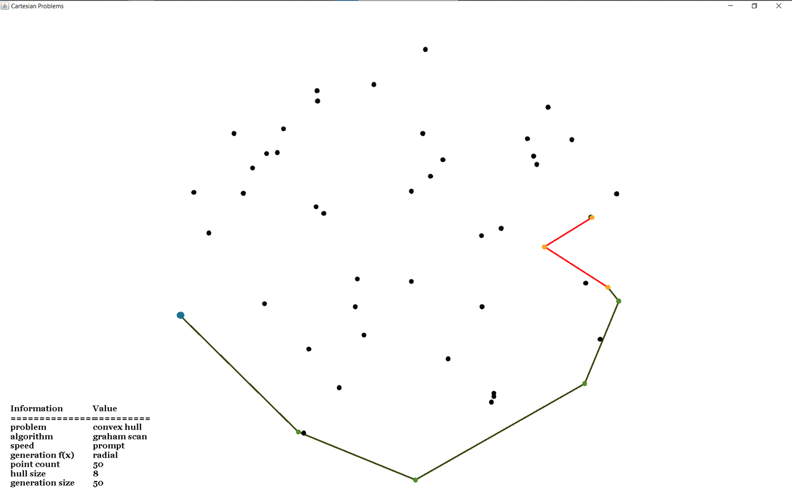
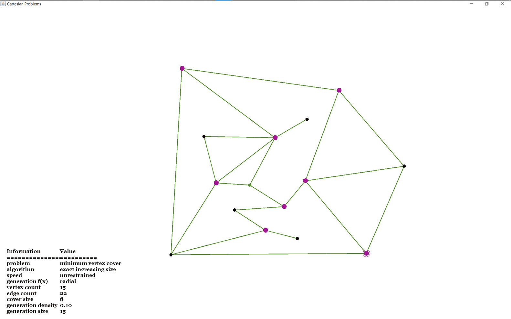

# Overview
This Java program exists to implement and visualized algorithms that solve the **convex hull** and **minimum vertex cover** problems. There are visual and automatic modes.

In **visual mode**, press `h` to available all keyboard commands. Different problem generation functions and algorithms can be used. Solve speed can be increased and decreased as desired. 

Starting more than one solve operation at a time is not allowed by the program. I'm sure it can be broken if you try hard enough though. 

In **automatic mode**, the program gradually increases size and varies other hyperparameters. It generates a problem and lets all algorithms attempt to solve the problem while timing them. It outputs relevant data to `performance.csv` in the current directory as the tests run. Thus, if the program terminates while mid-test, all data up to that point is saved. Note that this program is not designed to give the *best* solve times for the algorithms (if I was doing that, I'd write this in C++), but serves rather to compare the algorithms against each other.

# How to run
`main` is located in Core.java, so run that file. Next, select program mode, problem and problem size. The first letter of each option will suffice. In automatic mode, the following selections will start spitting out data to the screen and to `performance.csv`. 
~~~
C:\...\cartesianProblems> cmd /C <java.exe location> -cp C:\...\cartesianProblems\bin Core
Select Mode (visual|auto): a
Select Problem (convex hull|minimum vertex cover): v
Enter max problem size: 20
~~~
In visual mode, a new window should be opened up from which you can generate and solve problems.
~~~
C:\...\cartesianProblems> cmd /C <java.exe location> -cp C:\...\cartesianProblems\bin Core
Select Mode (visual|auto): v
Select Problem (convex hull|minimum vertex cover): c
Enter max problem size: 50
~~~

# Algorithms used
## Convex Hull
Two Algorithms were used.
## Minimum Vertex Cover
Two brute force algorithms and two approximation algorithms were used.
