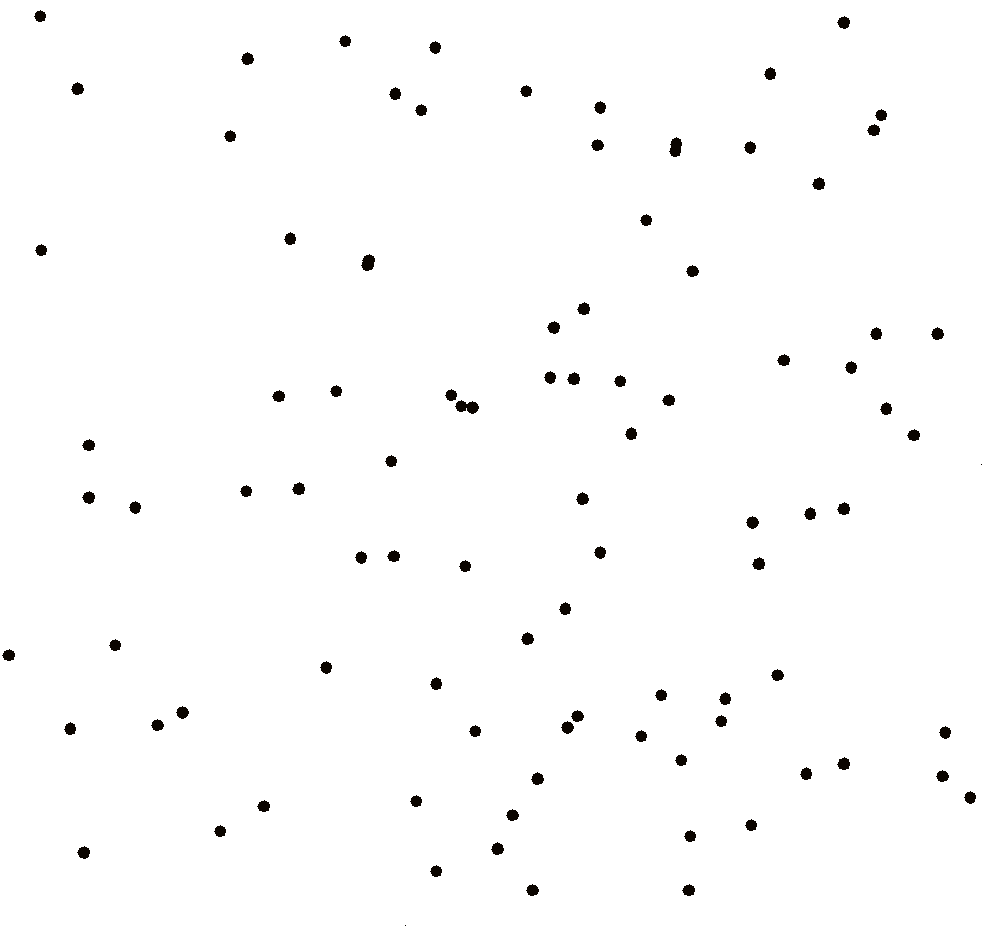

# Cartesian Problems
[Overview](#overview) | [Use](#use) | [How to Run](#how-to-run) | [Algorithm & Analysis](#algorithms--analysis) | [Limitations](#limitations)
## Overview
This Java program visualizes algorithms on a 2D plane. Currently, several algorithms are implemented for both the **convex hull** and **minimum vertex cover** problems. An automatic mode is also available for testing the relative performance of various algorithms.

Take for example this visualization of the Graham Scan algorithm that finds the Convex Hull.

A less efficient but possibly visually more pleasing algorithm is the Jarvis March.

As shown above, two algorithms can be chosen to solve the convex hull, the **Graham Scan** and the **Jarvis March**. For both, the **Akl-Toussaint** heuristic can be applied in either it's **quadrilateral** or **octahedral** variant.

Due to their intriguing impacts on algorithm performance, three distributions of point generation can be chosen (shown below).
Radial|Rectangular|Circular
:-------------------------:|:-------------------------:|:-------------------------
||

For finding the minimum vertex cover, two variants of the typical exact **brute force** solution are implemented. Also, two versions of the popular **Two's Approximation** are available. Below is an example of the brute force algorithm mid-solve.

## Use
In **visual** mode, press `K` to view all available keyboard commands. The most important ones allow the user to
* switch between problems
* change algorithms
* toggle heuristics
* alternate generation styles
* generate points/graphs
* increase and decrease visualization speed
* clear the canvass

The visualizations for each algorithm are explained in the [Algorithms & Analysis](#algorithms--analysis) section. This mode especially useful for teaching a classroom how a particular algorithm operates.

In **automatic** mode, the program gradually increases size and cycles through values for other hyperparameters such as heuristic, generation function, and graph density. It generates a problem and then times every available algorithm as it attempts to solve the problem.

It writes relevant data to `performance.csv` in the current directory as the tests run. Thus, if the program terminates while executing (Windows liked to force reboots while I was testing), all data gathered up to that point is saved.

## How to Run
1. Clone this repository and navigate to it in the command line. 
2. `main()` is located in Core.java, so compile and run that file.
3. Select the program mode, problem and problem size. The first letter of each option will suffice.

In automatic mode, the following selections will start spitting out data to the screen and to `performance.csv`. 
~~~
C:\...\cartesianProblems/src> javac Core.java && java Core
Select Mode (visual|auto): a
Select Problem (convex hull|minimum vertex cover): v
Enter max problem size: 20
~~~
In visual mode, a new window should be opened up from which you can generate and solve problems.
~~~
C:\...\cartesianProblems/src> javac Core.java && java Core
Select Mode (visual|auto): v
Select Problem (convex hull|minimum vertex cover): c
Enter max problem size: 50
~~~

## Algorithms & Analysis
In development . . .
### Convex Hull
**Jarvis March**:

**Graham Scan**:
### Minimum Vertex Cover
Two brute force algorithms and two approximation algorithms were used.

## Limitations
Starting more than one solve operation at a time should be blocked by the program, but I'm sure it can be broken if you try hard enough.

This program is not designed to give the *best* solve times for the algorithms (if I was doing that, I'd write this in C++). Conditional statements are run to determine whether an algorithm should paint results to a canvass or not. This introduces some overhead though it does not seem to skew testing in any noticeable way. Nevertheless, the automatic mode serves to compare the algorithms against each other, not against other implementations.